# Simple LMS API - Advanced Backend Learning Management System


A production-like Learning Management System (LMS) REST API built using **Django Ninja**. This project demonstrates modern backend development practices including JWT authentication, role-based authorization, Redis caching, MongoDB analytics, asynchronous task processing with Celery and RabbitMQ, monitoring with Flower, and containerized deployment using Docker Compose.

---

# Features

## Authentication

- JWT Authentication
- Access Token & Refresh Token
- Current User Endpoint

## Authorization

- Role-Based Access Control (RBAC)
  - Admin
  - Instructor
  - Student

## Course Management

- Course CRUD
- Course Detail
- Course Export (CSV)

## Learning System

- Student Enrollment
- Lesson Progress Tracking
- Automatic Certificate Generation

## Performance

- Redis Course List Cache
- Redis Course Detail Cache
- Cache Invalidation Strategy

## Analytics

- MongoDB Activity Logs
- MongoDB Learning Analytics
- User Event Tracking

## Asynchronous Processing

- Enrollment Email Notification
- Certificate Generation
- Course Report Export
- Scheduled Statistics Update

## Monitoring

- Flower Dashboard
- RabbitMQ Management Dashboard

## Deployment

- Docker Compose
- PostgreSQL
- Redis
- MongoDB
- RabbitMQ
- Celery Worker
- Celery Beat
- Flower

---

# Technology Stack

| Technology     | Purpose                            |
| -------------- | ---------------------------------- |
| Python 3.11    | Programming Language               |
| Django 5.2     | Backend Framework                  |
| Django Ninja   | REST API Framework                 |
| PostgreSQL     | Relational Database                |
| Redis          | Caching                            |
| MongoDB        | Activity Logs & Learning Analytics |
| RabbitMQ       | Message Broker                     |
| Celery         | Background Task Processing         |
| Celery Beat    | Scheduled Tasks                    |
| Flower         | Task Monitoring                    |
| Docker Compose | Container Orchestration            |

---

# System Architecture

The application follows a production-like backend architecture where the Django Ninja API communicates with multiple services. PostgreSQL stores relational data, Redis handles caching, MongoDB stores activity logs and analytics, RabbitMQ acts as the message broker, Celery Worker processes asynchronous tasks, Celery Beat schedules periodic jobs, and Flower provides real-time monitoring.

Architecture Flow

```text
                Client
                   │
                   ▼
          Django Ninja REST API
       ┌────────┼───────────┐
       ▼        ▼           ▼
 PostgreSQL   Redis      MongoDB
       │
       └────────────┐
                    ▼
               RabbitMQ
             ┌──────┴──────┐
             ▼             ▼
      Celery Worker   Celery Beat
             │
             ▼
           Flower
```

---

# Installation

## Clone Repository

```bash
git clone https://github.com/ArvinFarrelP/simple-lms-advanced.git
cd simple-lms-advanced
```

---

## Build Docker Containers

```bash
docker compose up --build
```

Run the containers in detached mode if preferred.

```bash
docker compose up -d --build
```

---

## Check Running Containers

```bash
docker compose ps
```

Expected services:

```text
web
db
redis
mongodb
rabbitmq
celery-worker
celery-beat
flower
```

---

## Run Database Migration

```bash
docker compose exec web python manage.py migrate
```

---

## Create Superuser

```bash
docker compose exec web python manage.py createsuperuser
```

---

## Create Initial Sample Data

If your project provides a seed command:

```bash
docker compose exec web python manage.py seed
```

or

```bash
docker compose exec web python manage.py loaddata initial_data.json
```

(Use the command available in your project.)

---

## Access Application

| Service            | URL                            |
| ------------------ | ------------------------------ |
| Swagger API        | http://localhost:8000/api/docs |
| Django Admin       | http://localhost:8000/admin    |
| Flower             | http://localhost:5555          |
| RabbitMQ Dashboard | http://localhost:15672         |

RabbitMQ Default Credentials

```text
Username : guest
Password : guest
```

---

# Project Structure

```text
simple-lms-advanced/
│
├── api/
├── config/
├── lms/
├── reports/
├── img/
│   ├── 1_Redis_Cache/
│   ├── 2_Cache_Invalidation/
│   ├── 3_MongoDB_Activity/
│   ├── 4_Learning_Analytics/
│   ├── 5_Async_Email_Notification/
│   ├── 6_Async_Report/
│   ├── 7_Async_Certificate/
│   ├── 8_Scheduled_Task/
│   ├── 9_Flower_Monitoring/
│   ├── 10_Docker_Compose/
│   ├── architecture-diagram.png
│   └── rabbitmq-dashboard.png
│
├── docker-compose.yml
├── Dockerfile
├── requirements.txt
├── manage.py
└── README.md
```

---

The following sections describe API usage, authentication, feature verification, screenshots, and testing procedures for every implemented feature.

# API Endpoints

## Authentication

| Method | Endpoint             | Description                    |
| ------ | -------------------- | ------------------------------ |
| POST   | `/api/auth/register` | Register a new user            |
| POST   | `/api/auth/login`    | User login                     |
| POST   | `/api/auth/refresh`  | Refresh JWT access token       |
| GET    | `/api/auth/me`       | Get current authenticated user |

---

## Courses

| Method | Endpoint                          | Description                |
| ------ | --------------------------------- | -------------------------- |
| GET    | `/api/courses`                    | List all courses           |
| GET    | `/api/courses/{course_id}`        | Get course detail          |
| POST   | `/api/courses`                    | Create a new course        |
| PATCH  | `/api/courses/{course_id}`        | Update a course            |
| DELETE | `/api/courses/{course_id}`        | Delete a course            |
| POST   | `/api/courses/{course_id}/export` | Export course report (CSV) |

---

## Enrollments

| Method | Endpoint                                | Description                  |
| ------ | --------------------------------------- | ---------------------------- |
| POST   | `/api/enrollments`                      | Enroll student into a course |
| GET    | `/api/enrollments/my-courses`           | Get enrolled courses         |
| POST   | `/api/enrollments/{enroll_id}/progress` | Update lesson progress       |

---

# Authentication

This project uses **JWT (JSON Web Token)** authentication.

Every protected endpoint requires an Access Token obtained from the login endpoint.

Example request:

```http
POST /api/auth/login
```

Example response:

```json
{
  "access": "<jwt_access_token>",
  "refresh": "<jwt_refresh_token>"
}
```

Copy the **Access Token**.

Open **Swagger API Documentation** and click **Authorize**.

Enter:

```text
Bearer <access_token>
```

All protected endpoints can now be accessed according to the authenticated user's role.

---

# User Accounts

The following sample accounts are available for testing.

| Username | Password    | Role       |
| -------- | ----------- | ---------- |
| admin    | password123 | Admin      |
| arvin    | password123 | Instructor |
| student1 | password123 | Student    |

Role permissions:

| Feature              | Admin | Instructor | Student |
| -------------------- | :---: | :--------: | :-----: |
| Create Course        |  Yes  |    Yes     |   No    |
| Update Course        |  Yes  |    Yes     |   No    |
| Delete Course        |  Yes  |    Yes     |   No    |
| Export Course Report |  Yes  |    Yes     |   No    |
| Enroll Course        |  No   |     No     |   Yes   |
| Complete Lesson      |  No   |     No     |   Yes   |
| View Courses         |  Yes  |    Yes     |   Yes   |

---

# Feature Verification

## 1. Redis Cache

**Login as:** `student1` or `arvin`

Both Student and Instructor can access the course list endpoint.

### Step 1 — Login

```
POST /api/auth/login
```

Username

```text
student1
```

Password

```text
password123
```

or

Username

```text
arvin
```

Password

```text
password123
```

Click **Authorize** in Swagger and paste the Access Token.

Screenshot

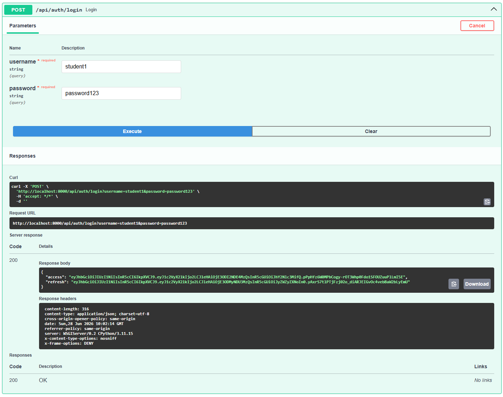

---

### Step 2 — First Request

Execute

```
GET /api/courses
```

Expected response

```json
{
    "source":"database",
    "count":1,
    "results":[...]
}
```

Explanation

Redis does not contain cached data yet, so the API retrieves data from PostgreSQL and stores it in Redis.

Screenshot


---

### Step 3 — Second Request

Execute the same endpoint again.

```
GET /api/courses
```

Expected response

```json
{
    "source":"redis cache",
    "count":1,
    "results":[...]
}
```

Explanation

The data is now returned directly from Redis Cache without querying PostgreSQL.

Screenshot

```text
.png)
```

---

## 2. Cache Invalidation

**Login as:** `arvin`

Only the Instructor role is allowed to create, update, or delete courses.

### Step 1 — Login

```
POST /api/auth/login
```

Username

```text
arvin
```

Password

```text
password123
```

Authorize using the Instructor Access Token.

Screenshot

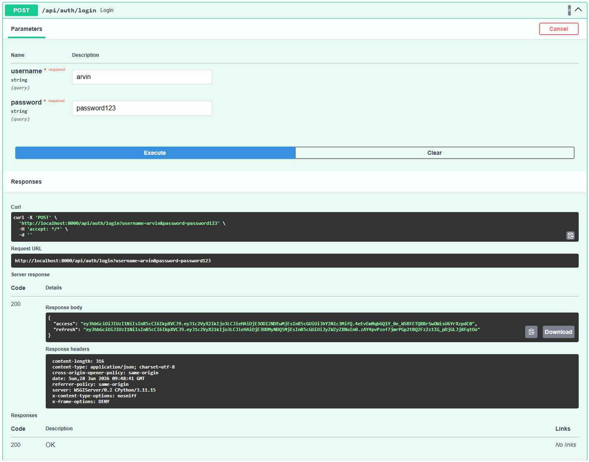

---

### Step 2 — Verify Cache

Execute

```
GET /api/courses
```

Expected response

```json
{
  "source": "redis cache"
}
```

This confirms that Redis Cache is currently active.

Screenshot

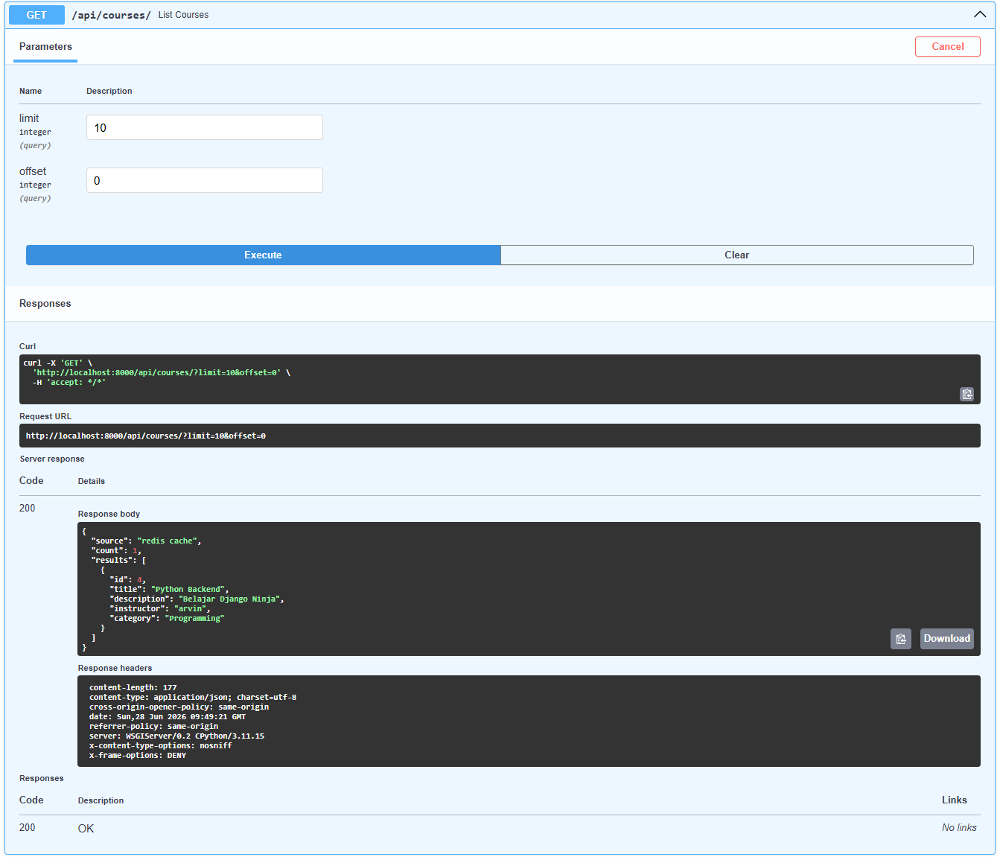

---

### Step 3 — Create Course

Execute

```
POST /api/courses
```

Example request

```json
{
  "title": "Docker",
  "description": "Docker Compose Deployment"
}
```

The application automatically executes

```python
cache.clear()
```

which removes the outdated cache.

Screenshot

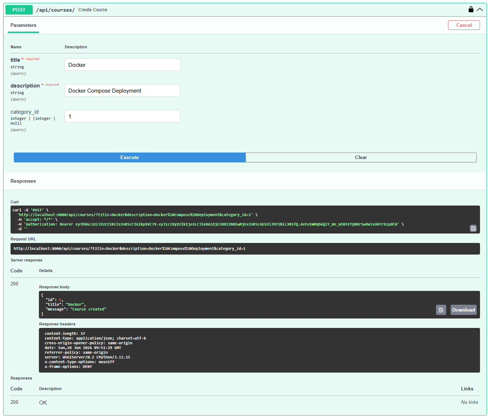

---

### Step 4 — Verify Cache Invalidation

Execute

```
GET /api/courses
```

Expected response

```json
{
  "source": "database"
}
```

Explanation

The old Redis cache has been cleared, forcing the API to retrieve fresh data from PostgreSQL.

Screenshot


---

### Step 5 — Verify New Cache

Execute the same endpoint once more.

```
GET /api/courses
```

Expected response

```json
{
  "source": "redis cache"
}
```

Explanation

A new cache has been created after retrieving the latest data from the database.

Screenshot

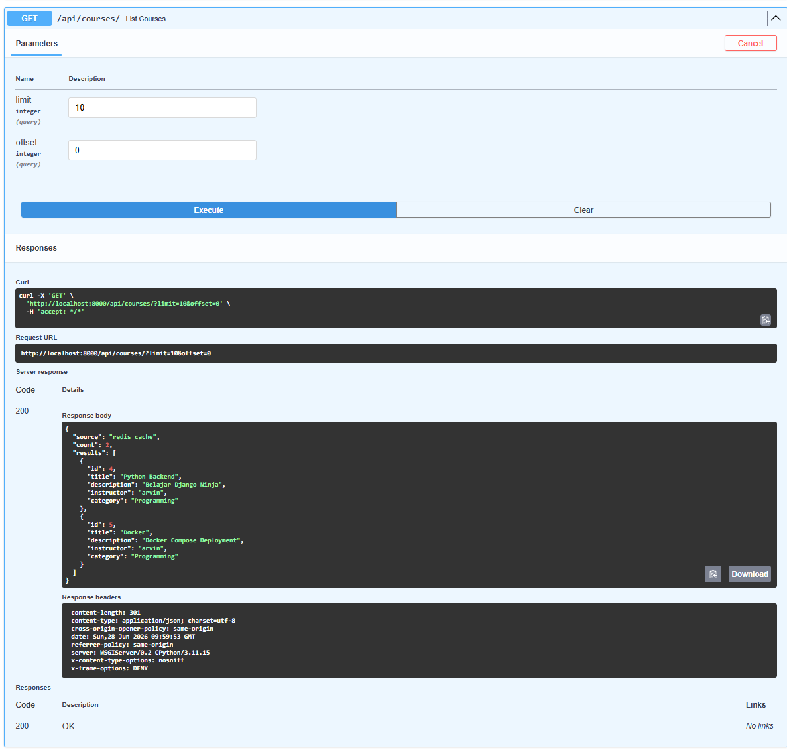

---

The next section covers MongoDB Activity Logs, Learning Analytics, Email Notification, and Report Generation using Celery and RabbitMQ.

# MongoDB Integration

## 3. MongoDB Activity Logs

**Login as:** `student1`

Activity Logs record every important user action performed in the system.

Examples include:

- User Login
- Course Enrollment
- Lesson Completion

Each activity is stored in the **activity_logs** collection inside MongoDB.

### Step 1 — Login

```http
POST /api/auth/login
```

Username

```text
student1
```

Password

```text
password123
```

---

### Step 2 — Perform User Activities

Execute the following actions:

- Login
- Enroll into a course
- Complete one or more lessons

These actions automatically call the logging function and store activity records in MongoDB.

---

### Step 3 — Open MongoDB Shell

```bash
docker exec -it lms_mongodb mongosh
```

Use the database

```javascript
use lms_activity
```

Show available collections

```javascript
show collections
```

Expected output

```text
activity_logs
learning_analytics
```

Screenshot

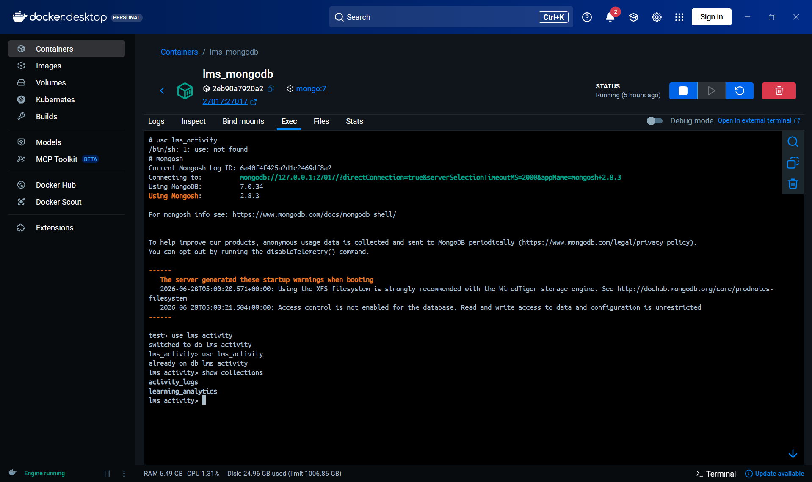

---

### Step 4 — View Activity Logs

Execute

```javascript
db.activity_logs.find().pretty();
```

Example output

```json
{
    "username":"student1",
    "action":"login"
}

{
    "username":"student1",
    "action":"enroll_course"
}

{
    "username":"student1",
    "action":"complete_lesson"
}
```

This confirms that every important user action is successfully recorded in MongoDB.

Screenshot

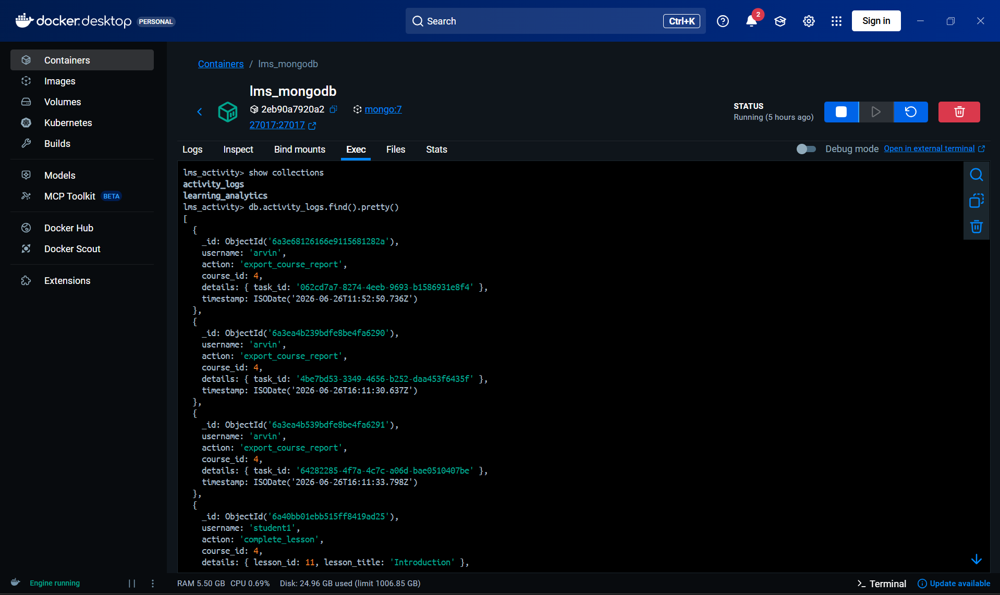

---

# Learning Analytics

## 4. Learning Analytics Collection

**Login as:** `student1`

Learning Analytics stores information about the student's learning progress.

Unlike Activity Logs, this collection focuses on learning events such as course enrollment and lesson completion.

---

### Step 1 — Complete Learning Activities

Execute the following actions:

- Enroll into a course
- Complete Lesson 1
- Complete Lesson 2
- Complete Lesson 3

---

### Step 2 — View Analytics Collection

Inside MongoDB execute

```javascript
db.learning_analytics.find().pretty();
```

Example output

```json
{
    "event":"enroll"
}

{
    "event":"lesson_completed"
}

{
    "event":"lesson_completed"
}

{
    "event":"lesson_completed"
}
```

The collection should contain one **enroll** event and three **lesson_completed** events.

This confirms that learning analytics data is successfully stored.

Screenshot

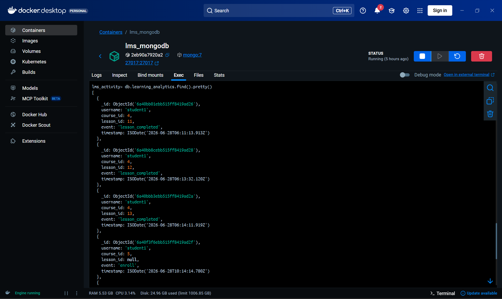

---

# Asynchronous Processing

## 5. Async Email Notification

**Login as:** `student1`

Email notifications are processed asynchronously using Celery and RabbitMQ.

The API immediately returns a response while the email task is executed in the background.

---

### Step 1 — Login

```http
POST /api/auth/login
```

Username

```text
student1
```

Password

```text
password123
```

---

### Step 2 — Enroll into a Course

Execute

```http
POST /api/enrollments
```

Expected response

```json
{
  "email_task": "queued"
}
```

The **queued** status indicates that the request has been sent to RabbitMQ and will be processed by a Celery Worker.

Screenshot

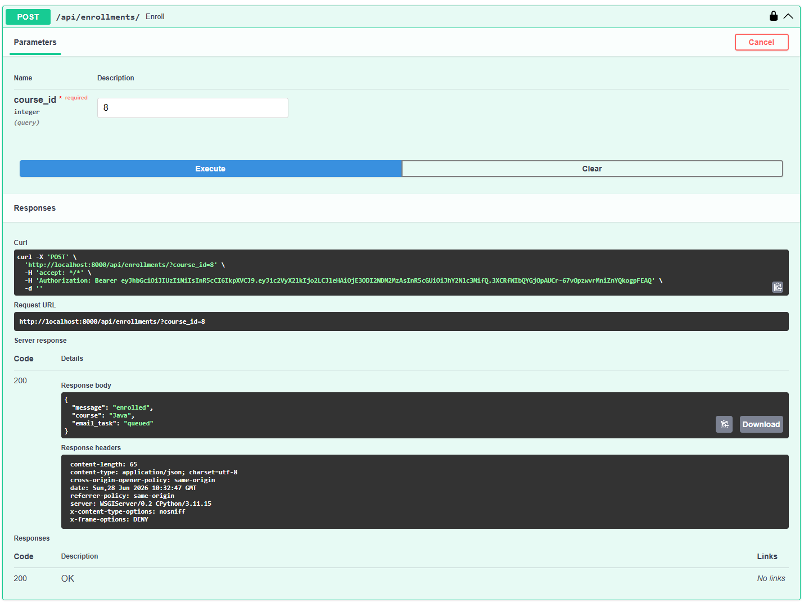

---

### Step 3 — Verify Using Flower

Open

```text
http://localhost:5555
```

Navigate to **Tasks**.

Expected task

```
send_enrollment_email
```

Status

```
SUCCESS
```

This confirms that the asynchronous email task has been successfully executed.

Screenshot

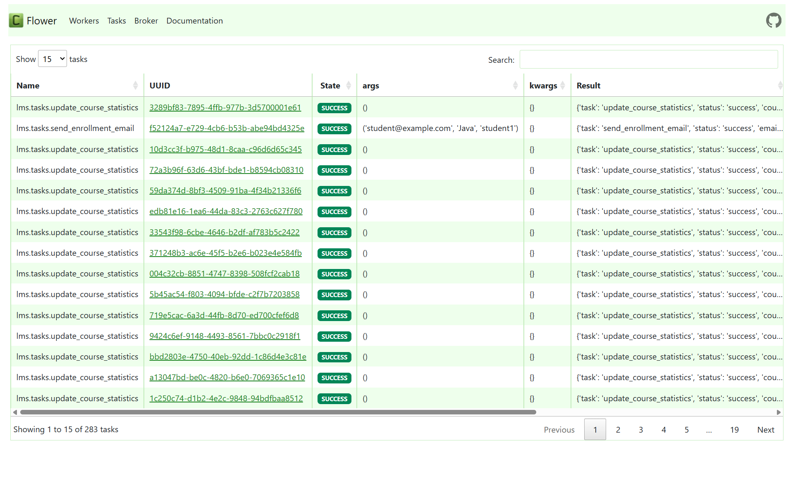

---

## 6. Async Course Report

**Login as:** `arvin`

Only the Instructor role is allowed to export course reports.

---

### Step 1 — Login

```http
POST /api/auth/login
```

Username

```text
arvin
```

Password

```text
password123
```

---

### Step 2 — Export Course Report

Execute

```http
POST /api/courses/4/export
```

Expected response

```json
{
  "status": "queued"
}
```

The API immediately returns the response while the report generation is processed asynchronously.

Screenshot

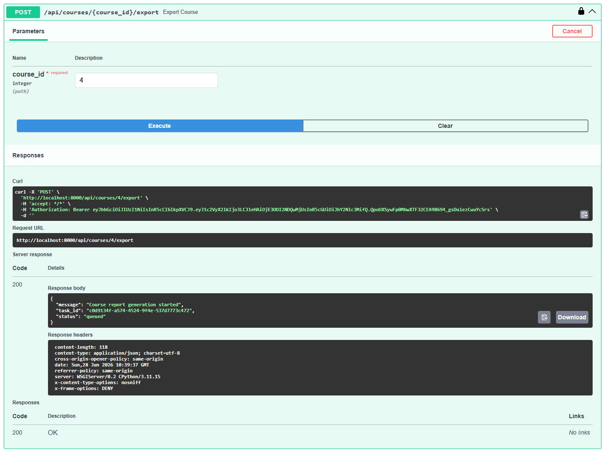

---

### Step 3 — Verify Task in Flower

Open

```text
http://localhost:5555
```

Expected task

```
export_course_report
```

Status

```
SUCCESS
```

Screenshot

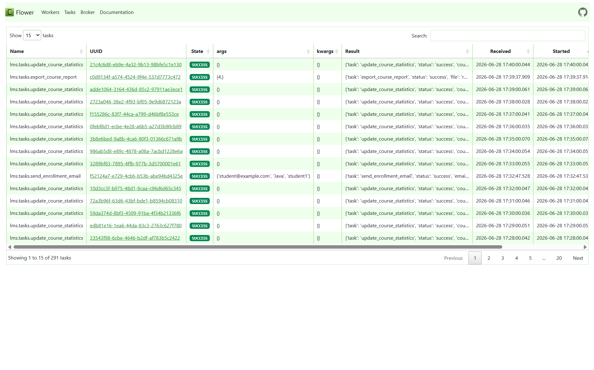

---

### Step 4 — Verify Generated CSV File

List generated reports

```bash
docker compose exec web ls reports
```

Expected output

```text
course_4_report.csv
```

View the file contents

```bash
docker compose exec web cat reports/course_4_report.csv
```

Example output

```csv
Course ID,Course Title,Enrollment Count
4,Python Backend,1
```

This confirms that the report has been successfully generated by the Celery Worker.

Screenshot

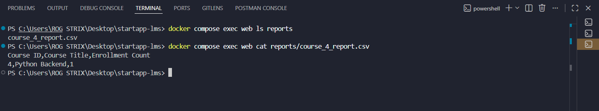

# Asynchronous Certificate Generation

## 7. Async Certificate

**Login as:** `student1`

Certificates are generated automatically after a student completes all lessons within a course. The certificate generation process is executed asynchronously using Celery and RabbitMQ.

---

### Step 1 — Login

```http
POST /api/auth/login
```

Username

```text
student1
```

Password

```text
password123
```

---

### Step 2 — Complete All Lessons

Complete every lesson in the enrolled course.

Example

```text
Lesson 11
Lesson 12
Lesson 13
```

Execute

```http
POST /api/enrollments/{enroll_id}/progress
```

for each lesson.

Expected response after the final lesson

```json
{
  "message": "Progress updated",
  "completed": true,
  "course_completed": true
}
```

The value

```text
course_completed = true
```

indicates that the course has been completed successfully.

Screenshots

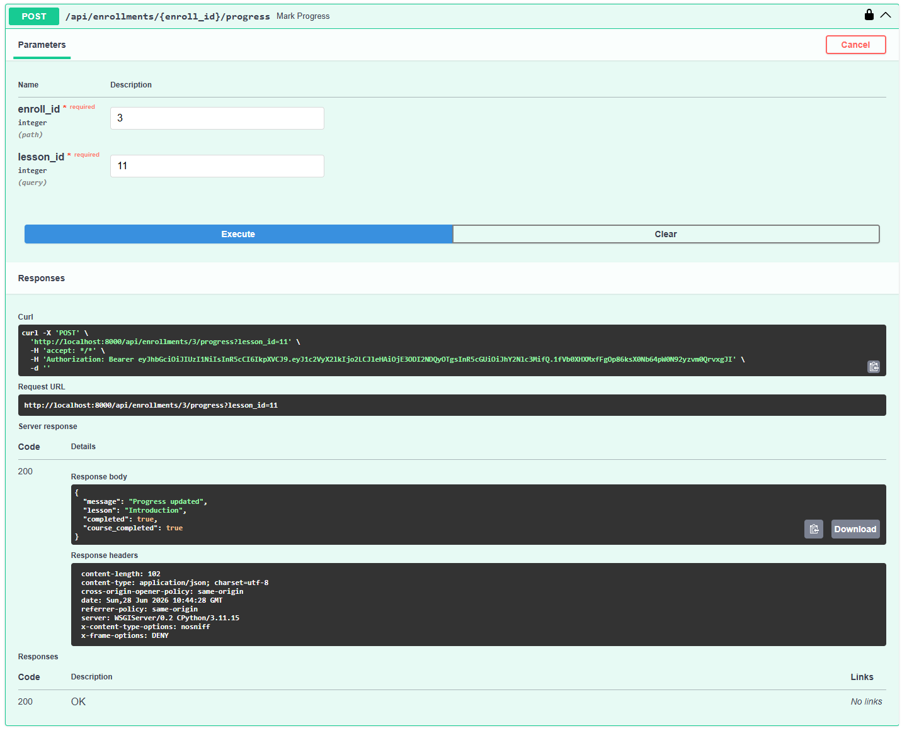

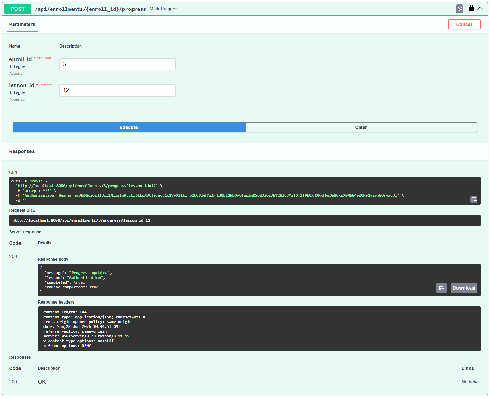

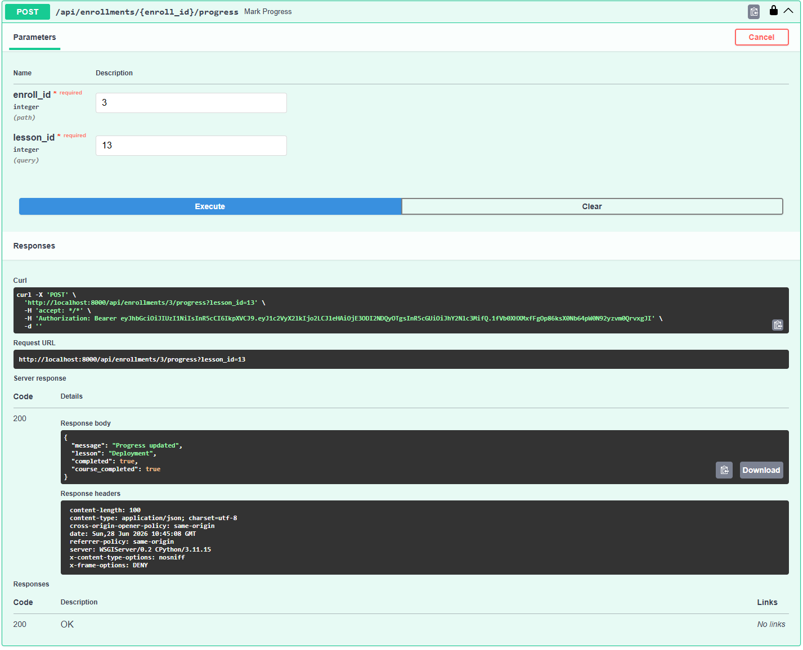

---

### Step 3 — Verify Background Task

Open Flower

```text
http://localhost:5555
```

Navigate to **Tasks**.

Expected task

```text
generate_certificate
```

Expected status

```text
SUCCESS
```

This confirms that the certificate generation task has been executed successfully by the Celery Worker.

Screenshot

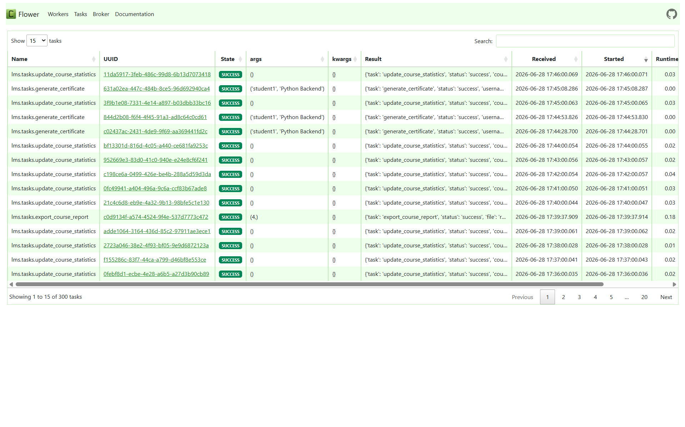

---

# Scheduled Tasks

## 8. Celery Beat

The project uses **Celery Beat** to execute scheduled tasks automatically without user interaction.

Currently implemented scheduled task:

```text
update_course_statistics
```

Execution interval

```text
Every 1 minute
```

Purpose

- Count total courses
- Count total enrollments
- Update course statistics

---

### Step 1 — View Celery Beat Logs

Execute

```bash
docker compose logs -f celery-beat
```

Expected output

```text
Scheduler: Sending due task
```

This message should appear automatically every minute.

Screenshot

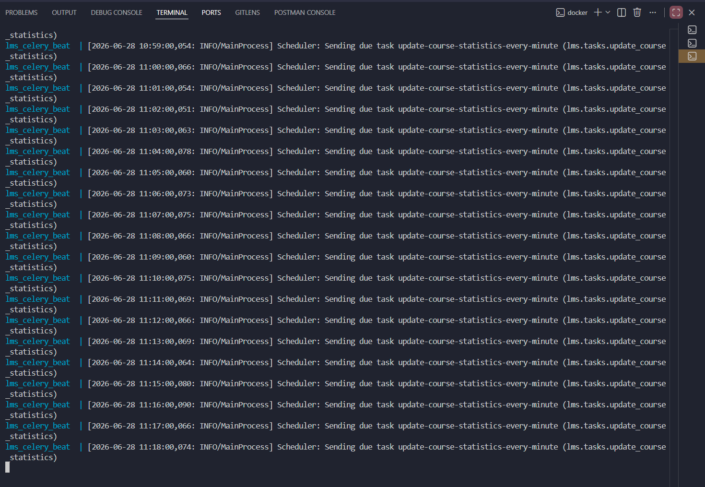

---

### Step 2 — Verify Scheduled Task in Flower

Open

```text
http://localhost:5555
```

The task

```text
update_course_statistics
```

should continue increasing over time with the status

```text
SUCCESS
```

This confirms that Celery Beat is successfully scheduling tasks and Celery Worker is executing them.

Screenshot

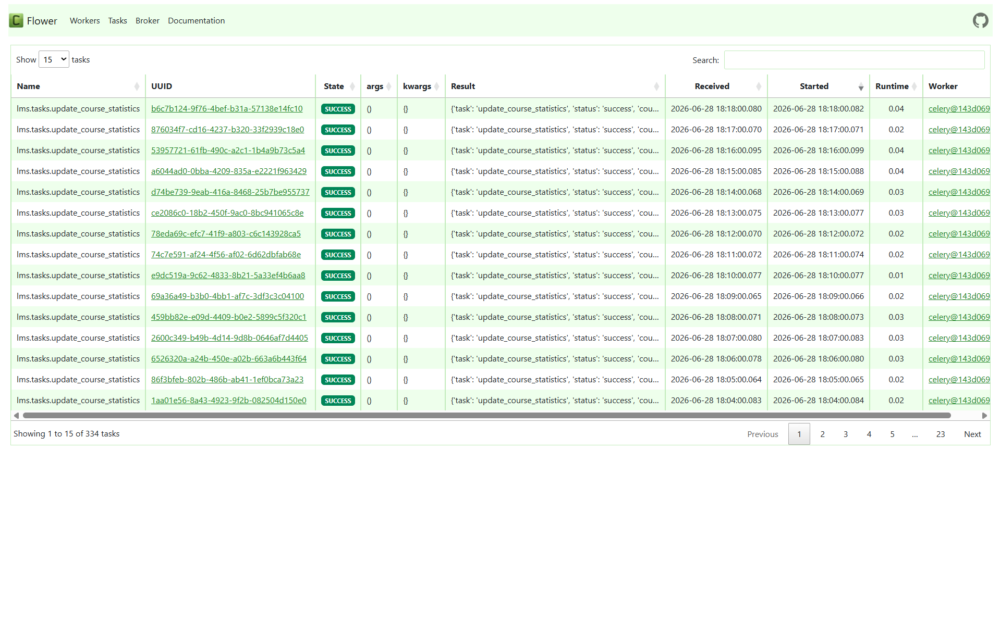

---

# Flower Monitoring

## 9. Flower Dashboard

Flower provides real-time monitoring for Celery Workers and task execution.

Open

```text
http://localhost:5555
```

Verify the following components.

### Workers

The worker should be online.

Expected status

```text
Online
```

---

### Broker

RabbitMQ Broker should be connected successfully.

---

### Tasks

The following tasks should appear.

```text
send_enrollment_email

generate_certificate

export_course_report

update_course_statistics
```

All completed tasks should have the status

```text
SUCCESS
```

Screenshots

Worker

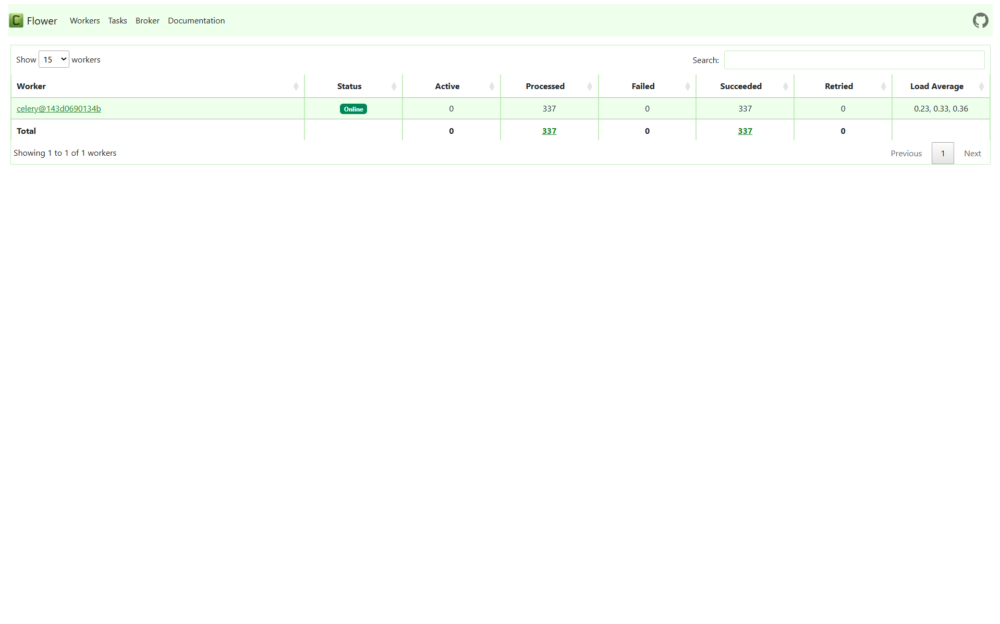

Tasks

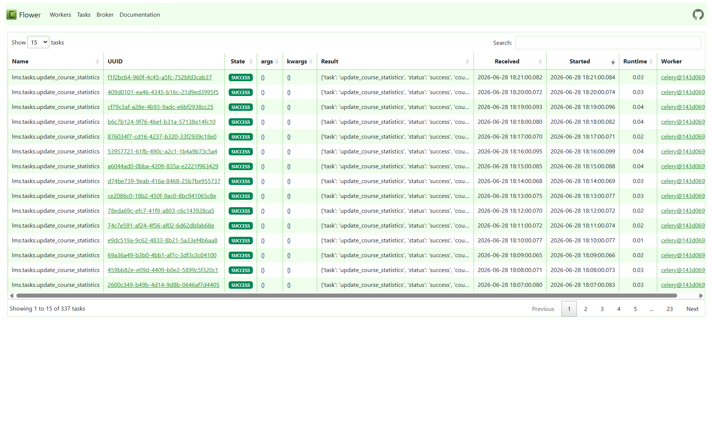

Broker

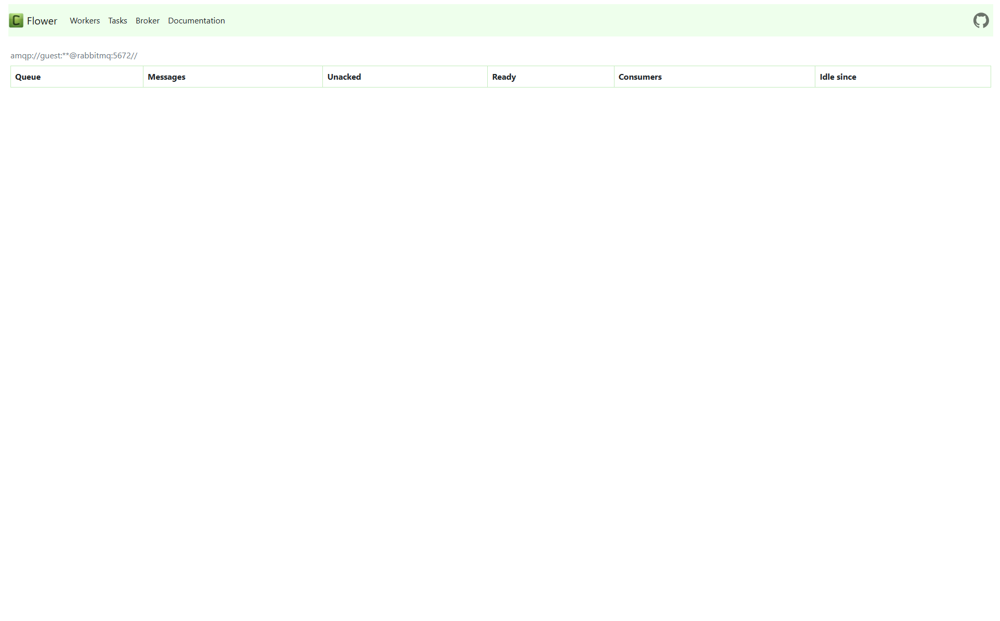

---

# Docker Compose Deployment

## 10. Production-like Docker Compose

The application is deployed using Docker Compose to simulate a production-like backend environment.

The project consists of the following containers.

```text
web
db
redis
mongodb
rabbitmq
celery-worker
celery-beat
flower
```

---

### Step 1 — Check Running Containers

Execute

```bash
docker compose ps
```

Expected output

```text
lms_web             Up

lms_db              Up

lms_redis           Up

lms_mongodb         Up

lms_rabbitmq        Up

lms_celery_worker   Up

lms_celery_beat     Up

lms_flower          Up
```

All services should display the **Up** status.

Screenshot

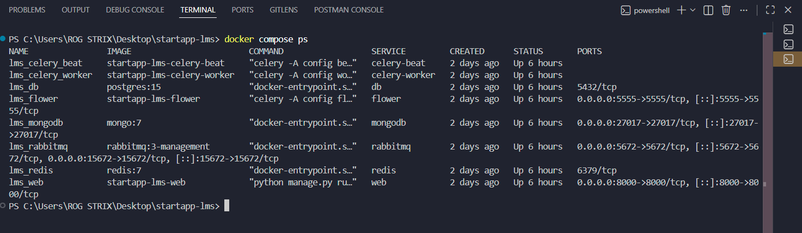

---

### Step 2 — Verify Docker Desktop

Open Docker Desktop.

Verify that every container is running successfully.

The following services should be visible.

- PostgreSQL
- Redis
- MongoDB
- RabbitMQ
- Django Web
- Celery Worker
- Celery Beat
- Flower

Screenshot


---

# Feature Verification Summary

| Feature                                   |  Status   |
| ----------------------------------------- | :-------: |
| Redis Course Cache                        | Completed |
| Cache Invalidation Strategy               | Completed |
| MongoDB Activity Logs                     | Completed |
| Learning Analytics Collection             | Completed |
| Asynchronous Email Notification           | Completed |
| Asynchronous Course Report                | Completed |
| Asynchronous Certificate Generation       | Completed |
| Scheduled Tasks (Celery Beat)             | Completed |
| Flower Monitoring                         | Completed |
| Production-like Docker Compose Deployment | Completed |

The implementation demonstrates a complete backend architecture integrating caching, asynchronous processing, analytics, monitoring, and containerized deployment using modern backend technologies.

# Project Structure

The project is organized into several modules to separate API logic, application configuration, business logic, documentation assets, and generated reports.

```text
simple-lms-advanced/
│
├── api/
│   ├── auth.py
│   ├── courses.py
│   ├── enrollments.py
│   ├── permissions.py
│   ├── jwt_utils.py
│   └── api.py
│
├── config/
│   ├── settings.py
│   ├── celery.py
│   ├── urls.py
│   └── wsgi.py
│
├── lms/
│   ├── models.py
│   ├── tasks.py
│   ├── mongo.py
│   ├── admin.py
│   └── migrations/
│
├── reports/
│   └── course_4_report.csv
│
├── img/
│   ├── architecture-diagram.png
│   ├── 1_Redis_Cache/
│   ├── 2_Cache_Invalidation/
│   ├── 3_MongoDB_Activity/
│   ├── 4_Learning_Analytics/
│   ├── 5_Async_Email_Notification/
│   ├── 6_Async_Report/
│   ├── 7_Async_Certificate/
│   ├── 8_Scheduled_Task/
│   ├── 9_Flower_Monitoring/
│   └── 10_Docker_Compose/
│
├── Dockerfile
├── docker-compose.yml
├── manage.py
├── requirements.txt
└── README.md
```

---

# Screenshots

The following screenshots demonstrate the successful implementation of each major feature.

## API Documentation

Swagger API Documentation

```text
img/swagger-api-documentation.png
```

---

## Django Administration

Django Admin Dashboard

```text
img/django-admin-dashboard.png
```

---

## Redis Caching

- Login
- Database Response
- Redis Cache Response

```text
img/1_Redis_Cache/
```

---

## Cache Invalidation

- Instructor Login
- Redis Cache
- Create Course
- Database Response
- Redis Cache Refresh

```text
img/2_Cache_Invalidation/
```

---

## MongoDB Activity Logs

- Collections
- Activity Logs

```text
img/3_MongoDB_Activity/
```

---

## Learning Analytics

- Learning Analytics Collection

```text
img/4_Learning_Analytics/
```

---

## Async Email Notification

- Student Enrollment
- Flower Monitoring

```text
img/5_Async_Email_Notification/
```

---

## Async Course Report

- Export Request
- Flower Task
- Generated CSV

```text
img/6_Async_Report/
```

---

## Async Certificate

- Lesson Completion
- Flower Task

```text
img/7_Async_Certificate/
```

---

## Scheduled Tasks

- Celery Beat
- Flower Monitoring

```text
img/8_Scheduled_Task/
```

---

## Flower Monitoring

- Workers
- Tasks
- Broker

```text
img/9_Flower_Monitoring/
```

---

## Docker Compose Deployment

- Running Containers
- Docker Desktop

```text
img/10_Docker_Compose/
```

---

# Useful Commands

## Docker

Start all services

```bash
docker compose up -d --build
```

Stop all services

```bash
docker compose down
```

View running containers

```bash
docker compose ps
```

View container logs

```bash
docker compose logs -f
```

---

## MongoDB

Open MongoDB shell

```bash
docker exec -it lms_mongodb mongosh
```

Select database

```javascript
use lms_activity
```

Show collections

```javascript
show collections
```

View activity logs

```javascript
db.activity_logs.find().pretty();
```

View learning analytics

```javascript
db.learning_analytics.find().pretty();
```

---

## Redis

Open Redis CLI

```bash
docker exec -it lms_redis redis-cli
```

View cache keys

```bash
KEYS *
```

View cache expiration

```bash
TTL course_list_10_0
```

Clear all cache

```bash
FLUSHALL
```

---

## Reports

List generated reports

```bash
docker compose exec web ls reports
```

Display report contents

```bash
docker compose exec web cat reports/course_4_report.csv
```

---

# Future Improvements

Several improvements can be implemented to further enhance the system.

- SMTP integration for sending real emails.
- PDF certificate generation.
- File storage integration for downloadable certificates.
- Dashboard visualization for learning analytics.
- Automated unit and integration testing.
- GitHub Actions CI/CD pipeline.
- Role permission management through Django Admin.
- Docker production configuration using Nginx and Gunicorn.
- Kubernetes deployment.
- API rate limiting and request throttling.
- API versioning.
- Performance monitoring with Prometheus and Grafana.

---

# Author

**Arvin Farrel Pramuditya**

Backend Engineer & AI Developer

Universitas Dian Nuswantoro

GitHub

```
https://github.com/ArvinFarrelP
```

LinkedIn

```
https://linkedin.com/in/ArvinFarrelP
```

---

# Conclusion

This project successfully implements a production-like Learning Management System backend using Django Ninja and modern backend technologies.

The system integrates PostgreSQL as the primary relational database, Redis for API caching, MongoDB for activity logging and learning analytics, RabbitMQ as the message broker, Celery for asynchronous task execution, Celery Beat for scheduled jobs, Flower for monitoring, and Docker Compose for container orchestration.

The implementation demonstrates several important backend engineering concepts, including JWT authentication, Role-Based Access Control (RBAC), Redis caching with cache invalidation, MongoDB analytics, asynchronous background processing, scheduled task execution, service monitoring, and containerized deployment.

Each required feature has been implemented, tested, documented, and verified through screenshots included in this repository. The project not only fulfills the requirements of the Server-Side Programming Final Project but also serves as a practical example of a scalable backend architecture following modern software engineering practices.
