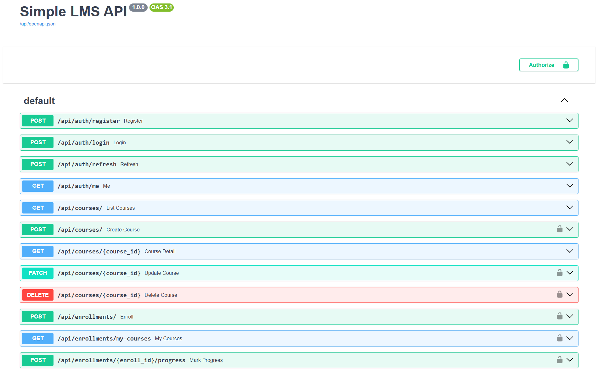
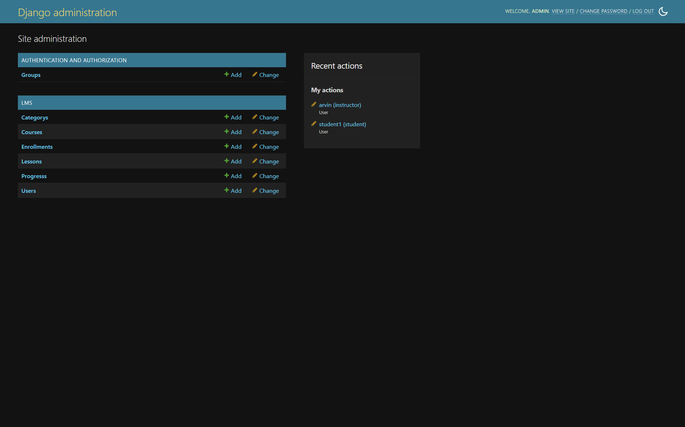
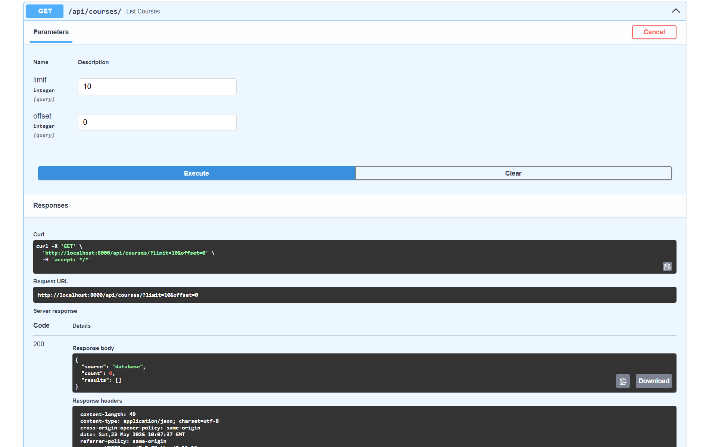
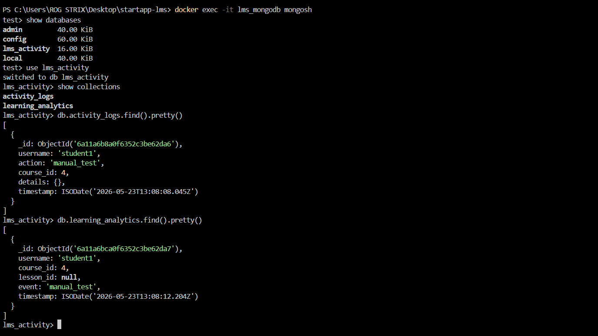
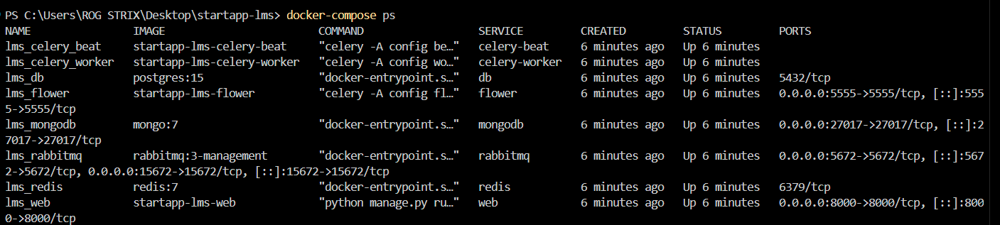
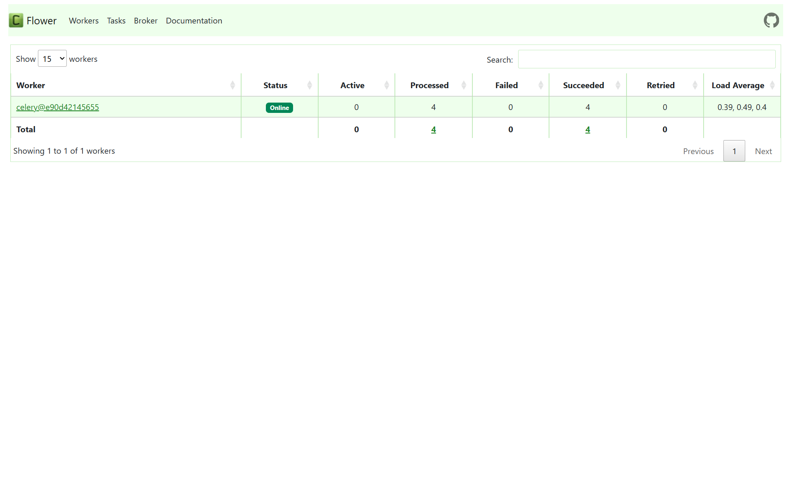
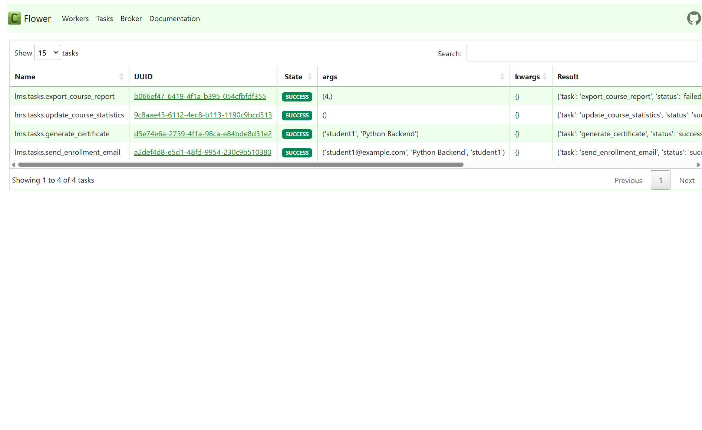
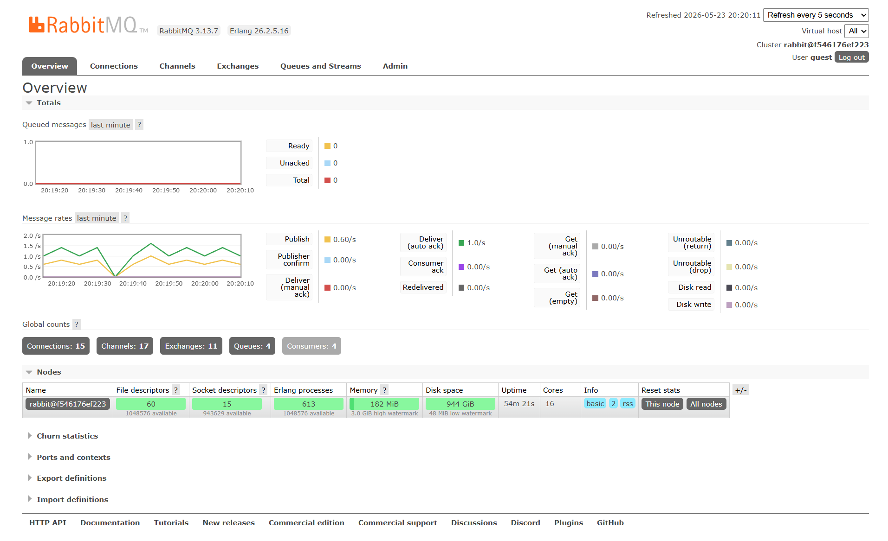
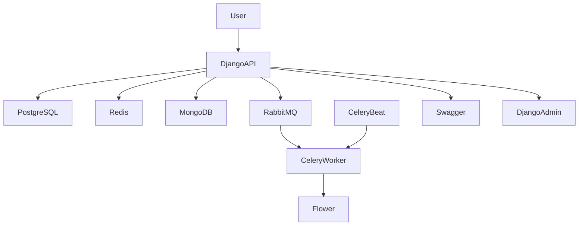

# Simple LMS API - Advanced Features

REST API Learning Management System menggunakan Django Ninja, Redis, MongoDB, Celery, RabbitMQ, dan Docker Compose.

---

# Features

- JWT Authentication
- Role-Based Access Control (RBAC)
- Course Management
- Enrollment System
- Progress Tracking
- Redis Caching
- MongoDB Activity Logs
- Learning Analytics
- Celery Background Tasks
- RabbitMQ Message Broker
- Flower Monitoring
- Docker Compose Integration
- Swagger API Documentation
- Django Admin Dashboard

---

# Tech Stack

| Technology     | Purpose                   |
| -------------- | ------------------------- |
| Django Ninja   | REST API Framework        |
| PostgreSQL     | Main Database             |
| Redis          | Caching                   |
| MongoDB        | Activity Logs & Analytics |
| Celery         | Asynchronous Tasks        |
| RabbitMQ       | Message Broker            |
| Flower         | Celery Monitoring         |
| Docker Compose | Container Orchestration   |

---

# Redis Integration

Implemented caching features:

- Course list caching
- Course detail caching
- Cache invalidation strategy
- Faster API response time

Example cache response:

```json
{
  "source": "redis cache",
  "count": 0,
  "results": []
}
```

Example database response after cache invalidation:

```json
{
  "source": "database",
  "count": 0,
  "results": []
}
```

---

# MongoDB Integration

MongoDB digunakan untuk:

- Activity Logs
- Learning Analytics
- Event Tracking

Collections:

- activity_logs
- learning_analytics

Example activity log document:

```json
{
  "username": "student1",
  "action": "enroll_course",
  "course_id": 4,
  "timestamp": "2026-05-23T13:08:08Z"
}
```

Example learning analytics document:

```json
{
  "username": "student1",
  "course_id": 4,
  "event": "lesson_completed",
  "timestamp": "2026-05-23T13:08:12Z"
}
```

MongoDB integration example:

```python
from pymongo import MongoClient
from datetime import datetime

client = MongoClient(settings.MONGO_URI)
db = client["lms_activity"]

activity_logs = db["activity_logs"]

activity_logs.insert_one({
    "username": username,
    "action": action,
    "course_id": course_id,
    "timestamp": datetime.utcnow()
})
```

---

# Celery Tasks

Implemented asynchronous background tasks:

| Task                     | Description                                  |
| ------------------------ | -------------------------------------------- |
| send_enrollment_email    | Send email after enrollment                  |
| generate_certificate     | Generate certificate after completing course |
| update_course_statistics | Update enrollment statistics                 |
| export_course_report     | Export CSV course report                     |

Example Celery task usage:

```python
from lms.tasks import *

send_enrollment_email.delay(
    "student1@example.com",
    "Python Backend",
    "student1"
)

generate_certificate.delay(
    "student1",
    "Python Backend"
)

update_course_statistics.delay()

export_course_report.delay(4)
```

---

# RabbitMQ Integration

RabbitMQ digunakan sebagai message broker untuk Celery worker.

Features:

- Queue management
- Background task distribution
- Worker communication
- Monitoring dashboard

RabbitMQ Dashboard:

```text
http://localhost:15672
```

Default login:

```text
Username: guest
Password: guest
```

---

# Flower Monitoring

Flower digunakan untuk monitoring Celery tasks dan workers.

Features:

- Worker monitoring
- Task status tracking
- Task success monitoring
- Queue inspection

Flower Dashboard:

```text
http://localhost:5555
```

---

# Docker Compose Services

Implemented services:

```yaml
services:
  web:
  db:
  redis:
  mongodb:
  rabbitmq:
  celery-worker:
  celery-beat:
  flower:
```

Check running containers:

```bash
docker-compose ps
```

---

# API Endpoints

## Authentication

- POST /api/auth/register
- POST /api/auth/login
- POST /api/auth/refresh
- GET /api/auth/me

## Courses

- GET /api/courses
- GET /api/courses/{course_id}
- POST /api/courses
- PATCH /api/courses/{course_id}
- DELETE /api/courses/{course_id}

## Enrollments

- POST /api/enrollments
- GET /api/enrollments/my-courses
- POST /api/enrollments/{enroll_id}/progress

---

# Swagger API Documentation

Swagger UI tersedia di:

```text
http://localhost:8000/api/docs
```

---

# Django Admin Dashboard

Django Admin tersedia di:

```text
http://localhost:8000/admin
```

---

# Installation

## Clone Repository

```bash
git clone https://github.com/ArvinFarrelP/simple-lms-api.git
cd simple-lms-api
```

---

# Run Project

```bash
docker-compose up --build
```

---

# Run Migration

```bash
docker-compose exec web python manage.py migrate
```

---

# Create Superuser

```bash
docker-compose exec web python manage.py createsuperuser
```

---

# MongoDB Commands

Open Mongo Shell:

```bash
docker exec -it lms_mongodb mongosh
```

Use database:

```bash
use lms_activity
```

Show collections:

```bash
show collections
```

View activity logs:

```bash
db.activity_logs.find().pretty()
```

View learning analytics:

```bash
db.learning_analytics.find().pretty()
```

---

# Redis Commands

Open Redis CLI:

```bash
docker exec -it lms_redis redis-cli
```

View cache keys:

```bash
KEYS *
```

Flush cache:

```bash
FLUSHALL
```

---

# Project Structure

```text
api/
config/
lms/
img/
docker-compose.yml
requirements.txt
README.md
```

---

# Screenshots

## Swagger API Documentation



---

## Django Admin Dashboard



---

## Redis Cache Hit


---

## Redis Database Hit



---

## MongoDB Activity Logs



---

## Docker Compose Services



---

## Flower Monitoring



---

## Celery Tasks Success



---

## RabbitMQ Dashboard



---

# Architecture Diagram



---

# Author

Arvin Farrel Pramuditya

---

# Conclusion

Project ini mengimplementasikan backend Learning Management System modern menggunakan Django Ninja dengan integrasi Redis caching, MongoDB logging, Celery asynchronous tasks, RabbitMQ message broker, Flower monitoring, dan Docker Compose orchestration.
